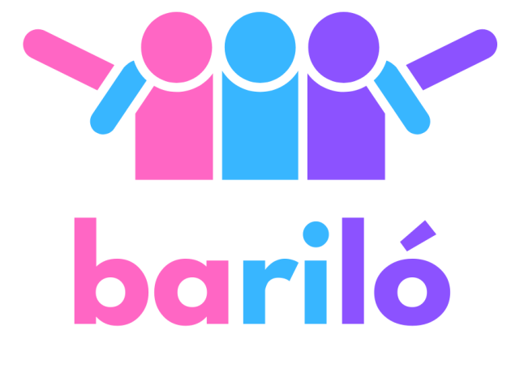

## Descripción 📚

**Bariló** es una innovadora webapp diseñada para transformar la experiencia de los viajes de egresados en Argentina, haciéndolos accesibles y personalizados para todos los estudiantes, sin importar su situación económica. 

[Ir al Repositorio Backend](https://github.com/igrowker/i003-barilo-back)

### El Problema 🎓

Los viajes de egresados, una tradición valiosa en la vida estudiantil argentina, se han vuelto inalcanzables para muchos jóvenes de bajos recursos. Esta situación genera exclusión y refuerza las diferencias sociales, haciendo que muchos estudiantes se vean obligados a renunciar a esta importante celebración.

Las empresas de viajes suelen ofrecer paquetes estandarizados, limitando la personalización y accesibilidad. Esta falta de alternativas adecuadas intensifica las desigualdades, resaltando la urgente necesidad de soluciones inclusivas.

---

## La Solución 💡

**Bariló** ofrece una plataforma responsiva que permite a los estudiantes y sus familias organizar su viaje de egresados desde cero. A través de una interfaz fácil de usar, los usuarios pueden:

1. **Planificar su viaje paso a paso**:
   - Elegir un destino y opciones de transporte (autobuses, vuelos, etc.).
   - Seleccionar alojamiento que se ajuste a su presupuesto.
   - Personalizar las comidas y actividades.

2. **Funcionalidad de Crowdfunding**: 
   - Permite a los estudiantes solicitar donaciones de familiares y amigos para financiar su viaje.

**Con Bariló, más estudiantes pueden disfrutar de su viaje de egresados de manera justa y asequible, cerrando la brecha económica.**

---

## Tecnologías Utilizadas 🛠️

Este proyecto está desarrollado utilizando las siguientes tecnologías:

- **Git** y **GitHub**: Para control de versiones y colaboración.
- **GitHub Actions**: Para integración continua y despliegue automático.
- **TypeScript**: Para un desarrollo más robusto y escalable.
- **Tailwind CSS**: Para un diseño moderno y responsivo.
- **React**: Para construir una interfaz de usuario interactiva.
- **Java** y **Spring**: Para el desarrollo del backend.

---

## Contribuidores 🤝

**¡Gracias a todos los que han hecho posible este proyecto!**

### Equipo Front-End

### Equipo Back-End

---

¡Gracias por tu interés en Bariló! Juntos podemos hacer que los viajes de egresados sean una experiencia inclusiva y accesible para todos. 🚀
